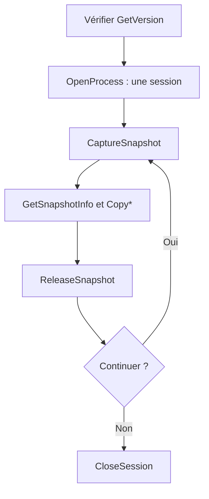

# Guide développeur — SDK 0.6.x

[Documentation](README.md) · [Premier tutoriel](tutorial-first-tool.md) · [Référence API](api-reference.md)

Ce guide explique comment intégrer le SDK dans une application après le premier
exemple. L'API publique observe la simulation en lecture seule, sur Windows x64.
Son contrat est défini dans `include/nimby/` ; les adaptateurs mémoire internes
restent dans le SDK.

## Choisir le niveau d'API

Pour un outil C++20, commencer par `<nimby/client.hpp>` : connexion, ressources,
captures automatiques à 250 ms, collections et recherches sont gérées par les helpers.
Le [tutoriel C++](tutorial-cpp-client.md) montre leur utilisation et la
[référence C++](cpp-api-reference.md) donne chaque type de retour et sa durée de vie.
Les opérations synchrones lèvent des exceptions ; les erreurs du worker sont
consultables via `getLastError()`.

Les sections suivantes expliquent aussi la gestion directe de l'API C.
Avec `Client`, son worker remplit déjà le rôle du thread de capture décrit ici ;
ne pas ajouter une deuxième boucle de capture sans besoin particulier.

## Les trois éléments à distinguer

| Élément | Où il tourne | Rôle |
|---|---|---|
| Votre outil, par exemple le TCO | Processus externe | Demande des captures et affiche les résultats |
| La DLL SDK de votre outil | À côté de votre exécutable | Implémente les fonctions `NimbySdk_*` utilisées par votre programme |
| Le proxy SDL et sa DLL SDK | Dossier du jeu, si installés | Chargent les diagnostics au démarrage du jeu ; inutiles pour ouvrir une session externe |

Le SDK n'est pas un chargeur universel de mods DLL. L'exemple crée un exécutable
consommateur. Le déposer dans le dossier des mods du jeu ne le fera pas exécuter.

## Intégration CMake

Le [tutoriel](tutorial-first-tool.md) fournit le projet complet. Pour une cible
existante, les éléments essentiels sont :

```cmake
find_package(NimbyRailsSDK 0.6 CONFIG REQUIRED)
target_compile_features(MyTool PRIVATE cxx_std_20)
target_link_libraries(MyTool PRIVATE NimbyRailsSDK::SDK)
add_custom_command(TARGET MyTool POST_BUILD
    COMMAND ${CMAKE_COMMAND} -E copy_if_different
        ${NimbyRailsSDK_RUNTIME_FILES} "$<TARGET_FILE_DIR:MyTool>"
    COMMAND_EXPAND_LISTS)
```

Passer la racine du kit à `CMAKE_PREFIX_PATH`. La variable
`NimbyRailsSDK_RUNTIME_FILES` contient les DLL de son dossier `bin/`.
Le consommateur peut aussi avoir ses propres dépendances de compilateur ou d'interface.

Utiliser une chaîne compatible avec le kit : le paquet MinGW ne fournit pas
de bibliothèque d'import MSVC. Les trois exemples C++ lient les runtimes GCC/C++
statiquement et copient les DLL du kit ; `libwinpthread-1.dll` reste nécessaire.

## Cycle de vie



Le diagramme décrit le parcours réussi ; traiter les statuts d'échec à chaque
étape. `DATA_UNAVAILABLE` conduit généralement à attendre puis réessayer.
`PROCESS_EXITED` impose de fermer la session et d'en ouvrir une sur la nouvelle
instance. Le SDK ne redémarre pas le jeu.

Un snapshot appartient au SDK jusqu'à `ReleaseSnapshot`. Les tableaux remplis
par `Copy*` appartiennent ensuite à votre programme. Ils restent utilisables
après libération du snapshot, mais décrivent toujours l'ancienne capture.

Utiliser un propriétaire unique par handle. Les gardes RAII non copiables de
`first-observer/main.cpp` évitent les oublis de fermeture en cas d'exception.
Le SDK limite les ressources à 8 sessions et 16 snapshots simultanés.

## Construire une interface réactive

Une capture peut être coûteuse. Dans une application graphique :

1. Garder la session dans un thread de travail.
2. Capturer et copier les collections nécessaires dans ce thread.
3. Libérer le snapshot dès les copies terminées.
4. Transmettre à l'interface un ensemble cohérent de données et son horodatage.
5. Attendre avant la prochaine capture ; une pause de 250 ms est un point de départ,
   pas une garantie de quatre captures par seconde.

Les appels d'observation sont sérialisés dans la DLL. Ajouter plusieurs threads
de capture ne garantit pas d'accélération. Éviter de bloquer le thread d'interface.

À l'arrêt, demander au worker de terminer et le joindre avant de fermer les
ressources ou de décharger la DLL. Ne pas appeler l'API depuis `DllMain` ou
un callback TLS.

## Afficher une donnée fiable

Distinguer trois situations dans votre modèle d'affichage :

| Situation | Exemple | Affichage |
|---|---|---|
| Connue et présente | Vitesse valide à 12 m/s | 43,2 km/h |
| Connue et vide | Réservations : `OK`, zéro intervalle | Aucune réservation observée |
| Inconnue | Réservations : `DATA_UNAVAILABLE` | Réservations indisponibles |

Contrôler les flags de chaque champ, même si la copie a réussi. Remplacer les
collections à chaque capture ; une ancienne réservation ou texture ne doit pas
rester affichée comme actuelle si la nouvelle lecture échoue.

Définir aussi un délai d'expiration dans l'application si les captures cessent.
Par exemple, le TCO utilise 1,5 seconde pour ses états/textures. Ce délai est un
choix d'affichage du client, pas une garantie du SDK.

Relier les objets par leur ID complet et dans le même snapshot. Pour de grandes
cartes, construire des index par ID après copie afin d'éviter les recherches
linéaires de l'exemple pédagogique.

## Exploiter le réseau

- **Voies et gares :** `train.track_id → track.id → track.station_id → station.id`.
  La gare de la voie ne donne pas le prochain arrêt.
- **Signaux :** `state.signal_id` et `texture.signal_id` rejoignent `signal.id`.
  Un type de signal ou un index de texture ne suffit pas à nommer son aspect.
- **Réservations et occupation :** lire les deux composants indépendamment,
  filtrer par `train_id`, puis dessiner leurs intervalles sur `track_id`.
- **Paths :** la liste de voies d'un Path n'est pas la liste des voies réservées.
- **Graphe :** les liaisons principales sont partielles ; ne pas en déduire une
  position d'aiguille ou un itinéraire ferroviaire complet.

La [référence](api-reference.md) donne le contrat de chaque collection.
L'exemple `observer` montre les états des signaux et les compteurs de portions
natives. Les [notes sur les signaux](signal-states.md) expliquent les sélecteurs
et fichiers de textures disponibles.

## Versions et compatibilité

Trois contrôles répondent à trois questions différentes :

| Contrôle | Question |
|---|---|
| Version du paquet, par exemple 0.6.0 | Quelles fonctions sont disponibles dans cette DLL ? |
| ABI 1 | La disposition des structures et les signatures sont-elles compatibles ? |
| SHA-256 du jeu | L'adaptateur sait-il lire cet exécutable précis ? |

CMake limite la compatibilité du paquet à la même version mineure pendant la
phase 0.x. Le premier exemple accepte SDK 0.6.x / ABI 1. Un nouvel export peut
manquer dans une ancienne DLL même si son ABI vaut aussi 1.

Avec une liaison normale, Windows résout les imports avant `main` : une DLL
sans `GetVersion` peut empêcher le programme de démarrer. Une application qui
doit diagnostiquer elle-même ces anciennes DLL peut choisir un chargement
explicite avec résolution des exports ; le TCO utilise cette approche.

## Distribuer votre programme

Distribuer ensemble l'exécutable, les DLL du kit nécessaires et les dépendances
propres à votre application. Tester depuis un dossier séparé qui ne dépend pas
du `PATH` de développement pour trouver les DLL du SDK.

Conserver les notices des composants distribués, notamment celles fournies
dans `share/licenses/`. MinHook est intégré à la DLL ; il n'y a pas de
`MinHook.dll` séparée. Le dépôt ne fournit pas de licence générale accordant
automatiquement tous les droits de redistribution ; les licences tierces
restent applicables.

Ne pas distribuer l'exécutable original du jeu ou sa SDL sauvegardée dans le
paquet de votre outil. Pour observer la partie depuis un autre processus,
les DLL de votre outil n'ont pas à être copiées dans le dossier du jeu.

## Compiler le SDK

Depuis la racine du dépôt SDK :

```powershell
powershell -NoProfile -ExecutionPolicy Bypass -File tools/build.ps1 -Configuration Release
```

Le script utilise les outils CLion, compile et exécute CTest. Si nécessaire,
ajouter `-ClionHome 'C:/chemin/CLion'`. Les presets et l'installation de
développement dans `install/Release` sont décrits dans [CLion](clion.md).

Pour construire le kit et contrôler les consommateurs :

```powershell
powershell -NoProfile -ExecutionPolicy Bypass -File tools/package.ps1
```

Le script construit Release, installe le kit sous `dist/NimbyRailsSDK-0.6.0/`,
copie les **trois exemples installés** dans des projets séparés sous `build/`,
les compile puis vérifie leur chargement sans jeu. Il crée aussi le ZIP et son
empreinte. Il ne publie rien et ne modifie pas le dossier du jeu.
`-SkipBuild` réutilise un build Release déjà configuré et validé.

Les docs sont installées sous `share/doc/NimbyRailsSDK/`. Le premier exemple
documenté est nouveau dans cette révision : les assets 0.6.0 déjà publiés ne sont
pas modifiés rétroactivement.

## Validation et limites

Les tests couvrent notamment les headers C, l'ABI, les buffers, les handles,
la lecture de mémoire simulée, les états/textures et le cycle de vie de la DLL.
Le test du proxy est activé quand `NIMBY_SDL_ORIGINAL` désigne une SDL originale.
Un succès synthétique ne prouve pas une synchronisation atomique avec le jeu.

Pour vérifier une capture réelle, avec une partie chargée et son PID actuel :

```powershell
./build/Release/nimby_observation_tests.exe 12345
```

Ce test optionnel attend notamment des trains dans la partie. Il vérifie aussi
la durée de vie des snapshots après fermeture de session. Le tutoriel peut,
lui, fonctionner sur une partie vide.

Les [rapports de recherche](README.md#recherche-et-validations) détaillent les
preuves par fonctionnalité. Les fonctions de diagnostic et les anciens
chargeurs sont documentés séparément dans [usage.md](usage.md).
